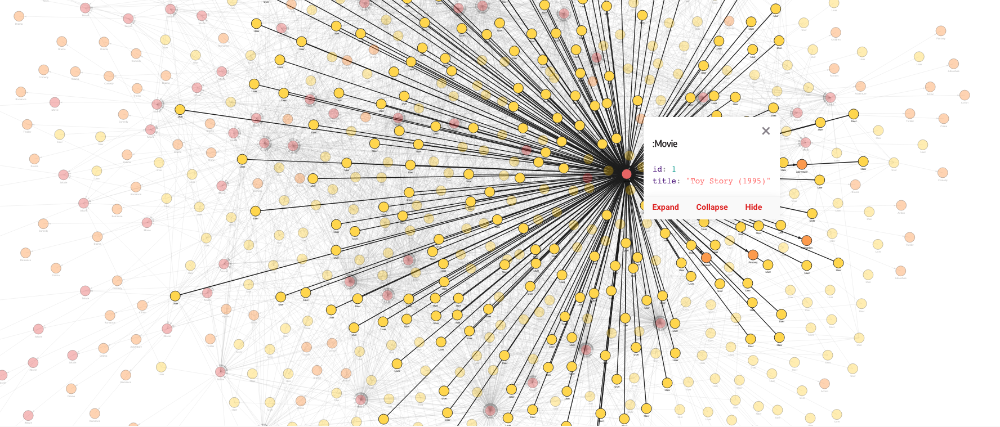

# An Introduction to Graph Databases with GQLAlchemy and Python
### Level: Beginner 
### Presentation: [An Introduction to Graph Databases with GQLAlchemy and Python](workshop/an-introduction-to-graph-databases-with-gqlalchemy-and-python.pdf)

## Workshop description
Through this tutorial, you will learn how to create a graph model from a dataset, run Memgraph with Docker, connect to it from a Jupyter Notebook with the help of GQLAlchemy, and perform simple queries. You will explore the movies dataset consisting of two CSV files: `movies.csv` containing movie title and genre and `ratings.csv` that holds information about users' ratings.

## Requirements
For this tutorial, you will need to install:

- [Jupyter](https://jupyter.org/install)
- [Docker](https://docs.docker.com/get-docker/)
- [GQLAlchemy](https://pypi.org/project/gqlalchemy/)
- [Pandas](https://pypi.org/project/pandas/)

## Usage
1. Clone the repository.
2. Start Jupyter Notebook and navigate to the workshop folder.
3. Run [gqlalchemy-workshop](https://github.com/pyladiesams/graphdbs-gqlalchemy-beginner-mar2022/blob/master/workshop/gqlalchemy-workshop.ipynb) notebook.

> For the solutions to the given exercises, first run the whole [gqlalchemy-workshop](https://github.com/pyladiesams/graphdbs-gqlalchemy-beginner-mar2022/blob/master/workshop/gqlalchemy-workshop.ipynb) notebook, and then run [gqlalchemy-solutions](https://github.com/pyladiesams/graphdbs-gqlalchemy-beginner-mar2022/blob/master/solutions/gqlalchemy-solutions.ipynb) notebook located in the solutions folder.

## Video record
Re-watch YouTube stream [here](https://youtu.be/Ay3C-vnCjCk)

## Credits
This workshop was set up by @pyladiesams and @katarinasupe
